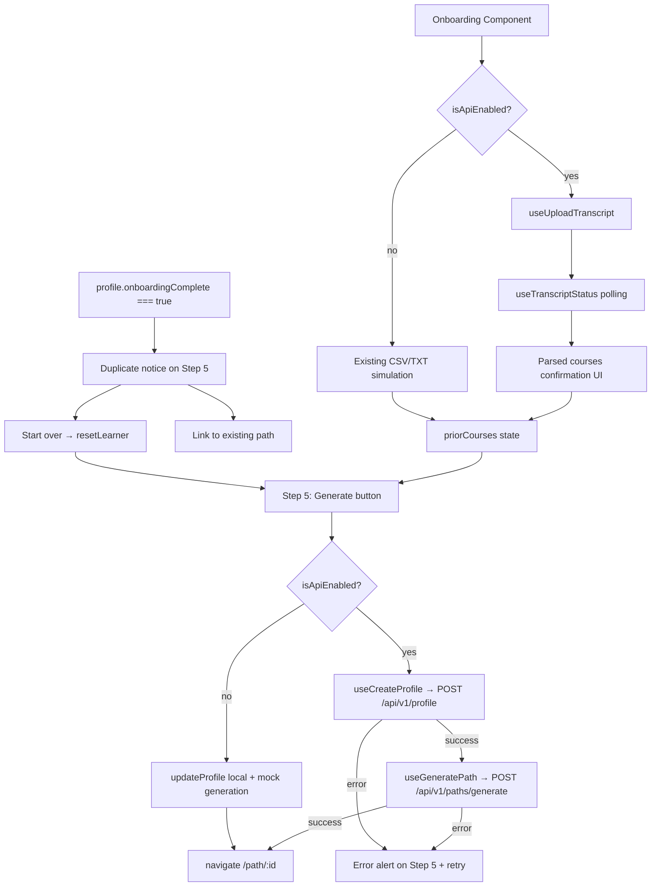

# Design Document: Onboarding Completion

## Overview

This document describes the technical design for wiring the existing 5-step onboarding wizard to backend APIs. The wizard UI, animations, accessibility, and responsive layout are already complete and must not change. The work is entirely additive: four async workflows (transcript upload, profile save, path generation, duplicate prevention) are connected to pre-built hooks, with all backend paths gated on `isApiEnabled` so the existing simulated experience remains the default fallback.

All four required hooks already exist in `src/hooks/`:
- `useUploadTranscript` / `useTranscriptStatus` — `use-transcript.ts`
- `useCreateProfile` — `use-profile.ts`
- `useGeneratePath` — `use-generate-path.ts`

The onboarding component only needs to call these hooks and respond to their state.

---

## Architecture

The change is confined to a single file: `src/routes/onboarding.tsx`. No new files, routes, or data models are introduced.



---

## Components and Interfaces

### State additions to `Onboarding` component

```typescript
// Transcript upload (Gap 1)
type UploadStatus = "idle" | "uploading" | "processing" | "completed" | "failed";

const [uploadStatus, setUploadStatus] = useState<UploadStatus>("idle");
const [uploadId, setUploadId] = useState<string | undefined>(undefined);
const [confirmedParsedCourseIds, setConfirmedParsedCourseIds] = useState<string[]>([]);

// Generation error (Gaps 2 & 3)
const [generationError, setGenerationError] = useState<string | null>(null);
```

### Hooks consumed

```typescript
const uploadMutation   = useUploadTranscript();
const transcriptStatus = useTranscriptStatus(uploadId);   // auto-polls at 2 s
const createProfile    = useCreateProfile();
const generatePath     = useGeneratePath();
```

### `handleFileUpload` (replaces inline `onChange`)

```typescript
async function handleFileUpload(file: File) {
  if (!isApiEnabled) {
    // existing simulation — unchanged
    return;
  }
  setUploadStatus("uploading");
  try {
    const { uploadId } = await uploadMutation.mutateAsync(file);
    setUploadId(uploadId);
    setUploadStatus("processing");
  } catch {
    setUploadStatus("failed");
  }
}
```

Polling is driven automatically by `useTranscriptStatus`. A `useEffect` watches `transcriptStatus.data?.status` and transitions `uploadStatus` to `"completed"` or `"failed"` accordingly.

### `handleGenerate` (replaces inline `onClick`)

```typescript
async function handleGenerate() {
  setGenerationError(null);

  if (!isApiEnabled) {
    // existing path — update local profile and trigger mock overlay
    updateProfile({ ...wizardData, onboardingComplete: true });
    setGenStage(0);
    setGenerating(true);
    return;
  }

  // 1. Save profile
  let profileId: string;
  try {
    const profileResponse = await createProfile.mutateAsync(buildProfilePayload());
    profileId = profileResponse.id;
  } catch (err) {
    setGenerationError(errorMessage(err));
    return;                          // stays on Step 5, overlay never shown
  }

  // 2. Update local state
  updateProfile({ ...wizardData, onboardingComplete: true });

  // 3. Show overlay, generate path
  setGenStage(0);
  setGenerating(true);

  try {
    const path = await generatePath.mutateAsync({ profileId, profile });
    navigate({ to: "/path/$id", params: { id: path.id } });
  } catch (err) {
    setGenerating(false);
    setGenStage(0);
    setGenerationError(errorMessage(err));
  }
}
```

### `buildProfilePayload` helper

Constructs a `CreateProfileRequest` from the wizard's local state:

```typescript
function buildProfilePayload(): CreateProfileRequest {
  return {
    name: profile.name,
    goal: goalText.trim() || `Become a ${role} and build a portfolio project.`,
    targetRole: role || targetPath.title,
    skillLevels,
    completedCourses: priorCourses,
    hoursPerWeek: hours,
    preferredFormats: formats,
    pace: pace === "intensive" ? "fast" : pace === "relaxed" ? "slow" : "moderate",
  };
}
```

---

## Data Models

No new types are introduced. All types come from `src/lib/types/api.ts`:

| Type | Source | Used for |
|------|--------|----------|
| `TranscriptUploadResponse` | `api.ts` | Upload mutation result |
| `TranscriptStatusResponse` | `api.ts` | Polling result; contains `parsedCourses` |
| `CreateProfileRequest` | `api.ts` | Profile POST body |
| `ProfileResponse` | `api.ts` | Profile POST response; provides `id` |
| `LearningPath` | `data/mock` | Generate mutation result; provides `id` |

---

## Correctness Properties

A property is a characteristic or behavior that should hold true across all valid executions of a system — essentially, a formal statement about what the system should do. Properties serve as the bridge between human-readable specifications and machine-verifiable correctness guarantees.

### Property 1: Parsed courses are fully displayed

*For any* `parsedCourses` array returned in a `TranscriptStatusResponse`, every entry's `title` and `confidence` value must appear in the rendered confirmation UI.

**Validates: Requirements 1.4**

### Property 2: Confirmed courses propagate to selection state

*For any* subset of parsed courses that the learner confirms, all confirmed course IDs must be present in `priorCourses` state after confirmation.

**Validates: Requirements 1.6**

### Property 3: Profile submission body contains all required fields

*For any* valid wizard state (any combination of role, goal, skill levels, prior courses, hours, formats, pace), calling `handleGenerate` with `isApiEnabled = true` must produce a `CreateProfileRequest` body containing every required field: `name`, `goal`, `targetRole`, `skillLevels`, `completedCourses`, `hoursPerWeek`, `preferredFormats`, and `pace`.

**Validates: Requirements 2.1, 2.2**

### Property 4: profileId is threaded from profile response to generate request

*For any* `profileId` string returned by `POST /api/v1/profile`, that exact value must be forwarded as `{ profileId }` in the body of the subsequent `POST /api/v1/paths/generate` call, with no mutation.

**Validates: Requirements 2.3, 3.1**

### Property 5: Navigation target matches the returned path id

*For any* path `id` returned by `POST /api/v1/paths/generate`, the router must navigate to `/path/{id}` using that exact value.

**Validates: Requirements 3.3**

---

## Error Handling

| Scenario | Behavior |
|----------|----------|
| Upload `POST` fails (non-2xx) | `uploadStatus → "failed"`, error message shown, file input re-enabled |
| Transcript polling returns `status: "failed"` | `uploadStatus → "failed"`, API error string shown, manual selection remains available |
| `POST /api/v1/profile` fails | `generationError` set, overlay never opens, retry available |
| `POST /api/v1/paths/generate` fails (non-zero status) | Overlay dismissed, `generationError` set on Step 5, retry available |
| `POST /api/v1/paths/generate` fails (status 0 / network) | `useGeneratePath` hook falls back to client-side generation automatically |
| `isApiEnabled = false` (any stage) | All API calls bypassed; existing simulated behavior runs unchanged |

---

## Testing Strategy

### Dual testing approach

Unit tests cover concrete examples and error states. Property-based tests (via `fast-check`, already used in the project) verify universal correctness across arbitrary inputs.

### Unit tests — `src/routes/onboarding.test.tsx`

Focus on specific examples and conditions:

- **Upload flow**: renders confirmation UI when `status: "completed"`; shows error when `status: "failed"`
- **Profile save failure**: overlay is not shown; error alert is visible on Step 5
- **Generate failure**: overlay is dismissed; error alert appears; retry re-calls the hook
- **Duplicate detection**: `onboardingComplete: true` shows notice and "Start over" button on Step 5
- **Start over**: calls `resetLearner`, clears the notice
- **Offline mode**: all four gaps fall through to existing simulation without API calls

### Property-based tests — `src/hooks/*.test.ts`

Most hook-level properties are already tested. New property tests belong in a `src/routes/onboarding.test.tsx` file or alongside hook tests:

| Property | Test approach |
|----------|---------------|
| P1: Parsed courses displayed | Generate arbitrary `parsedCourses[]`, render Step 3 in `"completed"` state, assert each title + confidence is present |
| P2: Confirmed courses in state | Generate arbitrary subset of parsed IDs, simulate confirmation, assert all IDs in `priorCourses` |
| P3: Profile body completeness | Generate arbitrary wizard inputs, call `buildProfilePayload`, assert all 8 required keys present with non-undefined values |
| P4: profileId threading | Mock `createProfile` to return arbitrary `profileId`, assert `generatePath` receives `{ profileId }` matching exactly |
| P5: Navigation target | Mock `generatePath` to return arbitrary `{ id }`, assert router navigates to `/path/${id}` |

Each property test must run a minimum of 100 iterations via `fast-check`.

Tag format: `Feature: onboarding-completion, Property {N}: {property_text}`
